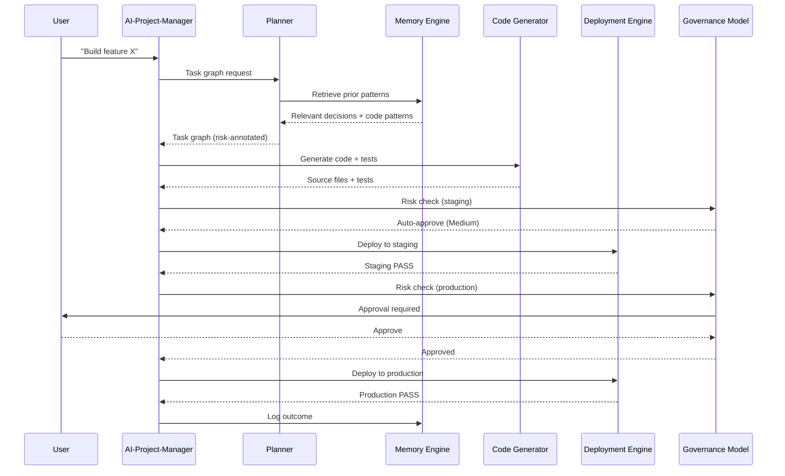
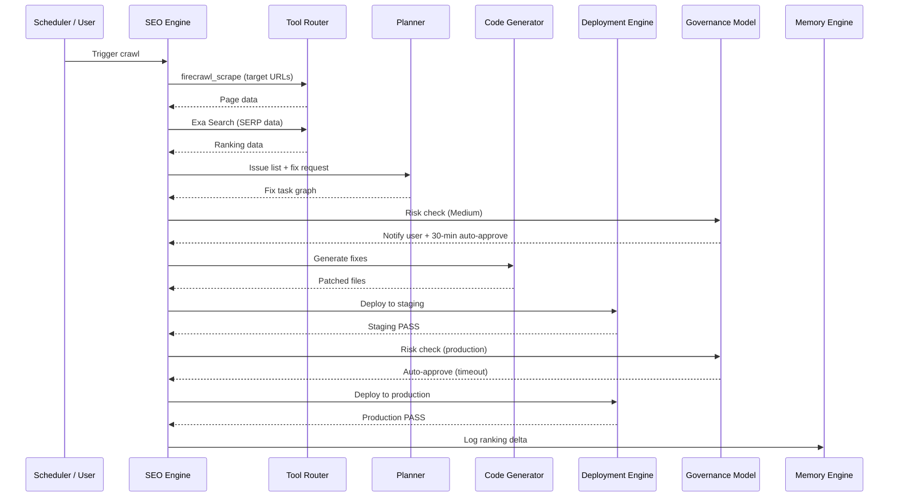
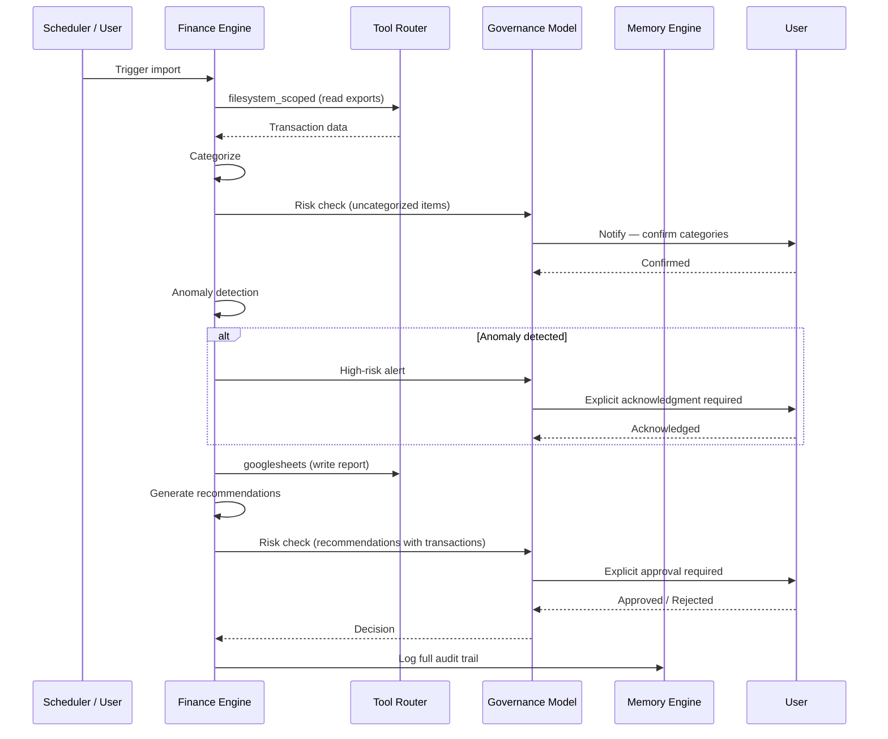

# open--claw Autonomy Loops

**Last updated:** 2026-02-23
**Author:** Agent (Phase 6A)

---

## Overview

Autonomy loops are the **operational patterns** that chain open--claw modules together into
repeatable, end-to-end workflows. Each loop maps to a core domain and operates semi-autonomously
within the bounds of the Governance Model.

Three loops are defined:

1. **App Builder Loop** — spec → code → test → deploy → monitor → iterate
2. **SEO Automation Loop** — crawl → analyze → fix → deploy → re-crawl → verify
3. **Financial Management Loop** — import → categorize → detect → report → recommend

---

## Loop: App Builder Loop

**Trigger:** User command (e.g., "build feature X" or "fix bug Y"), scheduled task, or
AI-Project-Manager PLAN phase advancement.

**Steps:**

1. **Plan** — Planner decomposes the spec into a task graph with risk levels.
2. **Context** — Memory Engine retrieves prior decisions, patterns, and related code.
3. **Generate** — Code Generator produces source files + tests following project standards.
4. **Review gate (High-risk)** — If target is production, pause for explicit approval.
5. **Stage deploy** — Deployment Engine deploys to staging environment.
6. **Test** — Executor runs tests; playwright verifies UI health.
7. **Monitor** — Deployment Engine monitors health metrics for configured window.
8. **Production gate (High-risk)** — Pause for explicit approval before production promotion.
9. **Produce deploy** — Deployment Engine promotes to production.
10. **Audit** — Memory Engine logs outcome; Executor writes audit entry.
11. **Iterate** — If tests/monitor fail, Planner re-plans with failure context.

**Success criteria:**
- All tests pass
- Health check returns 200 post-deploy
- No regression detected in monitoring window
- Audit log entry written

**Failure handling:**
- If Code Generator fails: retry with narrower scope; escalate to user after 2 attempts.
- If staging deploy fails: halt, log error, surface to user with rollback command.
- If production deploy fails: immediate auto-rollback to last known good; notify user.
- If monitoring detects degradation: auto-rollback; notify user.

**Approval gates:**
- Before production deploy (Step 8): **explicit human approval required** (High-risk)
- Batch production changes > 500 LOC: **explicit human approval** (High-risk)
- Staging-only changes: auto-approved (Low/Medium)

---

---

## Loop: SEO Automation Loop

**Trigger:** Scheduled (weekly cron), user command ("audit SEO for site X"), or ranking drop
alert from monitoring.

**Steps:**

1. **Crawl** — SEO Engine crawls target URLs via firecrawl-mcp; extracts page structure,
   meta tags, headings, internal links, structured data.
2. **Analyze** — SEO Engine scores each page against ruleset; ranks issues by estimated impact.
3. **Research** — Tool Router uses Exa Search for competitor SERP data and keyword benchmarks.
4. **Plan fixes** — Planner generates fix task graph (content changes, code changes, redirects).
5. **Review gate (Medium)** — Notify user of planned changes; auto-approve after 30-min timeout
   unless user rejects.
6. **Generate fixes** — Code Generator applies meta tag, content, structured data patches.
7. **Stage deploy** — Deployment Engine deploys fixes to staging.
8. **Verify staging** — playwright renders pages; SEO Engine re-checks scores.
9. **Production gate (Medium)** — Notify + auto-approve after timeout.
10. **Produce deploy** — Deployment Engine promotes SEO fixes to production.
11. **Re-crawl** — SEO Engine re-crawls after 24–72h (configurable).
12. **Verify ranking** — Exa Search checks SERP position delta; Memory Engine logs result.

**Success criteria:**
- SEO score improves by at least the minimum threshold (configurable, default: 10%)
- No new issues introduced
- Ranking maintained or improved within verification window
- Audit log entry written

**Failure handling:**
- Crawl failure: retry up to 3 times with exponential backoff; surface to user if all fail.
- Score regression on staging: halt, discard fix, flag issue for manual review.
- Production ranking drop detected post-deploy: alert user immediately; prepare rollback PR.

**Approval gates:**
- Fix plan review (Step 5): **notify + auto-approve after 30 min** (Medium)
- Production promotion (Step 9): **notify + auto-approve after 30 min** (Medium)
- Changes touching >20 pages: **explicit human approval required** (High-risk)

---

---

## Loop: Financial Management Loop

**Trigger:** Scheduled (monthly), user command ("generate finance report"), or anomaly alert
from the Finance Engine.

**Steps:**

1. **Import** — Finance Engine reads transaction exports from bill-pay sandbox (CSV/JSON).
   **Never accesses savings or operating accounts directly.**
2. **Categorize** — Finance Engine applies categorization ruleset; flags uncategorized items.
3. **Review uncategorized (Medium)** — Notify user of flagged items; wait for manual
   categorization or confirm auto-category.
4. **Detect anomalies** — Finance Engine compares against historical baselines; scores
   deviations by severity.
5. **Alert (High-risk)** — Any anomaly above threshold triggers immediate user notification;
   requires explicit acknowledgment before proceeding.
6. **Report** — Finance Engine generates structured report (Markdown + Google Sheets).
7. **Recommend** — Finance Engine produces actionable recommendations.
8. **Approval gate (High-risk)** — Any recommendation involving a financial transaction
   requires explicit human approval.
9. **Execute (if approved)** — Executor acts on approved recommendations via bill-pay
   sandbox only.
10. **Audit** — Memory Engine logs report, anomalies, decisions, and any actions taken.

**Success criteria:**
- All transactions categorized (0 uncategorized after review)
- Report generated and written to Google Sheets
- No anomalies left unacknowledged
- Audit entry written with full decision trace

**Failure handling:**
- Import failure: halt; notify user with exact error and remediation steps.
- Categorization failure: flag item, continue with rest; surface uncategorized batch to user.
- Anomaly detection error: treat as anomaly-present; notify user; do not proceed autonomously.
- Report generation failure: write partial report; surface to user.

**Approval gates:**
- Uncategorized review (Step 3): **notify + wait for user confirmation** (Medium)
- Anomaly acknowledgment (Step 5): **explicit human acknowledgment required** (High-risk)
- Any financial transaction (Step 8): **explicit human approval required** (High-risk)
- Savings/operating account access: **permanently blocked** — not wired, never auto-approved

---

---

## Loop Comparison

| Property | App Builder | SEO Automation | Financial Management |
|---|---|---|---|
| Trigger | User / PLAN | Schedule / User | Schedule / User |
| Frequency | On demand | Weekly | Monthly |
| Primary risk | Deployment (High) | Content change (Medium) | Financial action (High) |
| Auto-approve threshold | Staging only | Medium (30-min timeout) | Never for transactions |
| Rollback available | Yes (auto) | Yes (PR revert) | No (audit only) |
| External API dependencies | GitHub, playwright | firecrawl, Exa | Google Sheets, firestore |
