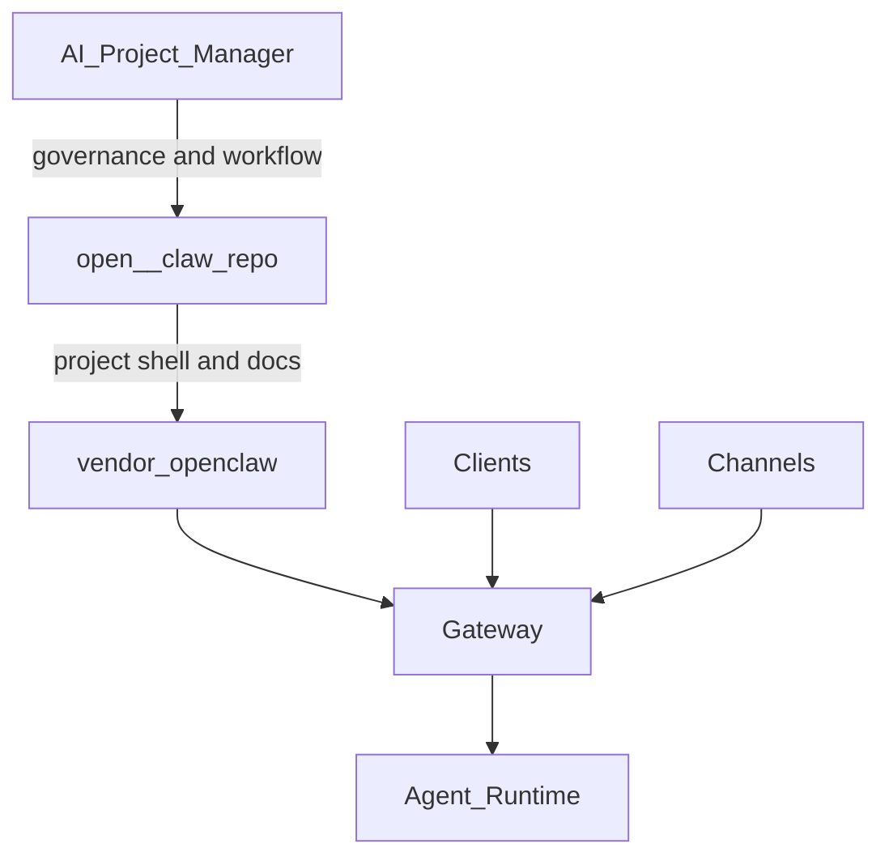

# Codebase Orientation

## Purpose

This note explains how the two local repos fit together and where work should happen.

- `D:\github\AI-Project-Manager` is the governance and workflow repo.
- `D:\github\open--claw` is the execution repo.
- `D:\github\open--claw\vendor\openclaw` contains the actual upstream runtime code.

If a task is about product behavior, boot flow, channels, agents, memory, UI, or mobile apps, start in `vendor/openclaw`.

## Repo Split

### `AI-Project-Manager`

Use this repo for:

- plans, state logs, and handoff notes
- Cursor rules and agent contracts
- MCP health, secret-handling rules, and workflow guidance
- architecture notes about how the system should be operated

Primary entry points:

- `README.md`
- `AGENTS.md`
- `docs/ai/PLAN.md`
- `docs/ai/STATE.md`
- `docs/ai/architecture/OPENCLAW_MODULES.md`

### `open--claw`

Use this repo for:

- Open Claw project docs and local operating blueprint
- config templates and skill inventory
- the vendored OpenClaw runtime

Primary entry points:

- `README.md`
- `AGENTS.md`
- `open-claw/docs/ARCHITECTURE_MAP.md`
- `open-claw/docs/MODULES.md`
- `vendor/openclaw/package.json`

## Runtime Boundaries

Operationally:

- `AI-Project-Manager` governs how work is planned, executed, and recorded.
- `open--claw` defines the local project shape and wraps the upstream app.
- `vendor/openclaw` is the codebase to inspect for implementation work.

## Where To Work

### Stay In `AI-Project-Manager`

- planning or phase execution
- state logging and evidence capture
- tool health, MCP config, or workflow rules
- cross-repo architecture notes

### Move To `vendor/openclaw`

- CLI behavior
- gateway boot or health
- agent runtime and session flow
- channel integrations
- web UI or mobile clients
- memory, plugins, providers, or skills runtime behavior

## Fast Runtime Map

Key source areas inside `vendor/openclaw/src`:

- `cli/` - command parsing, command registration, and command entry routing
- `gateway/` - WebSocket server, auth, health, runtime config, and Control UI serving
- `agents/` - agent runtime, tools, workspaces, transcripts, and session behaviors
- `channels/` - transport adapters and channel-facing abstractions
- `memory/` - embeddings, storage, and vector search
- `plugins/` - plugin discovery and plugin runtime
- `providers/` - LLM provider adapters
- `sessions/` - session lifecycle and history

Related app surfaces:

- `vendor/openclaw/ui` - Lit-based Control UI
- `vendor/openclaw/apps/android` - Android client
- `vendor/openclaw/apps/ios` - iOS client

## Boot Path

The most useful default deep dive is the runtime boot path, because the active project plan still has Phase 6B open for Gateway boot.

Follow this chain:

1. `vendor/openclaw/openclaw.mjs`
2. `vendor/openclaw/src/entry.ts`
3. `vendor/openclaw/src/cli/run-main.ts`
4. `vendor/openclaw/src/cli/program/build-program.ts`
5. `vendor/openclaw/src/cli/program/command-registry.ts`
6. One of the concrete command registrars, for example:
   - `vendor/openclaw/src/cli/program/register.onboard.ts`
   - `vendor/openclaw/src/cli/program/register.status-health-sessions.ts`
   - `vendor/openclaw/src/cli/program/register.agent.ts`
7. Command implementation files, for example:
   - `vendor/openclaw/src/commands/onboard.ts`
   - `vendor/openclaw/src/commands/health.ts`
   - `vendor/openclaw/src/commands/status.ts`
8. Gateway startup:
   - `vendor/openclaw/src/gateway/server.impl.ts`

In practice this means:

- `openclaw.mjs` loads built output
- `src/entry.ts` normalizes env and bootstraps the CLI
- `src/cli/run-main.ts` loads dotenv, validates runtime, and lazily registers only the needed command path
- `command-registry.ts` maps top-level command names to their real registrars
- `register.onboard.ts` converts Commander flags into `OnboardOptions`
- `commands/onboard.ts` chooses interactive vs non-interactive onboarding
- `gateway/server.impl.ts` validates config, applies migrations, resolves runtime settings, and starts the Gateway

## Recommended Reading Order

1. Read the two root `README.md` files.
2. Read `docs/ai/architecture/OPENCLAW_MODULES.md`.
3. Read `open-claw/docs/ARCHITECTURE_MAP.md`.
4. If the task is implementation-related, jump directly into `vendor/openclaw/src`.
5. Start with the boot path above before widening into agents, channels, or UI.

## Default Next Deep Dive

Choose `runtime boot path` first unless the task is clearly about a different subsystem.

Reason:

- it matches the current open phase in `docs/ai/PLAN.md`
- it identifies the fastest route from CLI invocation to running gateway
- it exposes the config, auth, and health checkpoints that most later debugging depends on
