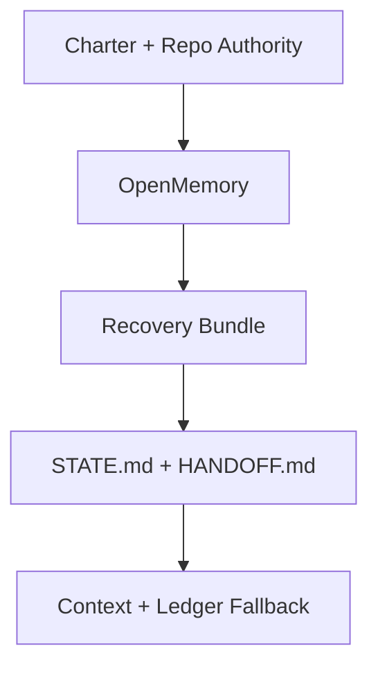
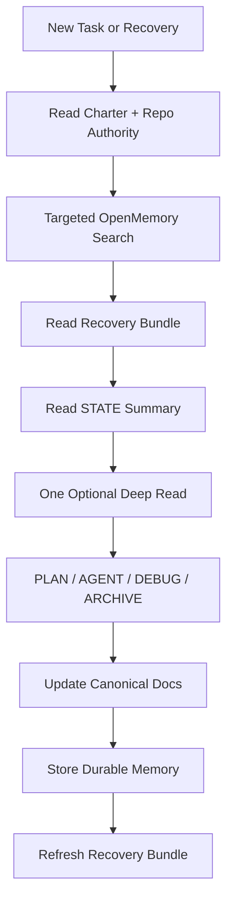

# No-Loss Memory Architecture

This document defines the current no-loss architecture for the tri-workspace.

It is intentionally grounded in the live Cursor tool surface, not an aspirational metadata model.

## Goal

Build a recovery system that:

- preserves durable project knowledge
- keeps active context small
- prevents cross-repo contamination
- lets PLAN recover from restart or power loss with minimal reads
- keeps canonical authority in repo-tracked docs instead of side channels

## Proven architecture

The no-loss system has five layers:

1. **Charter and repo authority** — canonical truth
2. **OpenMemory** — primary durable structured recall
3. **Recovery bundle** — non-canonical speed layer on the filesystem
4. **Operational evidence** — `STATE.md` and `HANDOFF.md`
5. **Forensic fallback** — `docs/ai/context/` and the execution ledger

## Authority boundaries

### Canonical

- `FINAL_OUTPUT_PRODUCT.md`
- repo-tracked rules and workflow docs
- repo-tracked durable memory docs such as `DECISIONS.md` and `PATTERNS.md`

### Operational but non-authoritative

- `STATE.md`
- `HANDOFF.md`

### Non-canonical support layers

- OpenMemory retrieval results
- recovery bundle files
- Obsidian notes
- Artiforge output
- execution ledger blocks

No support layer may override canonical repo docs.

## Recovery order

The bootstrap order is:

1. `FINAL_OUTPUT_PRODUCT.md`
2. Repo authority contract
3. Targeted OpenMemory search
4. Recovery bundle, if present and current
5. `STATE.md` summary/current state section
6. Exactly one of `DECISIONS.md`, `PATTERNS.md`, or `HANDOFF.md` if needed
7. Execution ledger one block at a time only as a fallback

This is the current minimal recovery loop. It replaces the old pattern of reading `STATE.md` first and broad-loading supporting docs.

## OpenMemory reality

The current Cursor-side OpenMemory surface is flat:

- `search-memories(query)`
- `list-memories()`
- `add-memory(content)`

The architecture must therefore avoid pretending the runtime supports rich scoped filters.

### What this means

- project isolation is enforced primarily by query phrasing plus canonical repo docs
- durable entries must be self-identifying in their text
- recovery depends on the repo contract and the recovery bundle, not on hidden metadata

Recommended text shape:

- `[repo=ai-pm][kind=decision][stability=durable][source=docs/ai/memory/DECISIONS.md] ...`
- `[repo=openclaw][kind=pattern][stability=durable][source=MEMORY_PROMOTION_TEMPLATE.md] ...`
- `[repo=tri-workspace][kind=policy][status=active][source=docs/ai/operations/NO_LOSS_RECOVERY_LOOP.md] ...`

## Role of each support tool

### OpenMemory

- Primary durable structured recall layer
- First retrieval step after authority docs
- Durable storage for validated compact decisions and patterns

### filesystem

- Reads and writes the machine-local recovery bundle
- Carries pointers, summaries, and reseed notes
- Never becomes canonical truth

### obsidian-vault

- Fast sidecar for operator notes and research
- Never default bootstrap
- Never a substitute for `STATE.md`, `HANDOFF.md`, `DECISIONS.md`, or `PATTERNS.md`

### Artiforge

- Synthesis and scaffold helper only
- Must operate after canonical docs are read
- Never defines authority or policy

### thinking-patterns

- Required for non-trivial planning, architecture, critique, and debugging
- Helps shape compact durable conclusions worth promoting into docs/OpenMemory

### serena

- Optional for docs-only governance passes
- Required when code/symbol surfaces matter

## No-loss loop

## Failure handling

If a required tool in the no-loss loop is degraded:

1. Fail loudly
2. State the exact broken step
3. Use the safest documented fallback only if the task remains satisfiable
4. Record the gap in `STATE.md`
5. Record reseed debt if memory storage/retrieval was skipped

Silent continuation is not allowed.

## Current target state

The target operating model is intentionally modest:

- canonical authority remains in repo docs
- OpenMemory carries compact durable recall
- recovery bundle avoids broad rereads after crashes
- `STATE.md` remains operational evidence, not first authority
- the execution ledger stays as a forensic fallback, not a preload surface

## Linked specifications

- `docs/ai/operations/NO_LOSS_RECOVERY_LOOP.md` — operating loop and triggers
- `docs/ai/operations/RECOVERY_BUNDLE_SPEC.md` — bundle contents, freshness, and update rules
- `docs/ai/memory/MEMORY_CONTRACT.md` — recovery order and storage discipline
