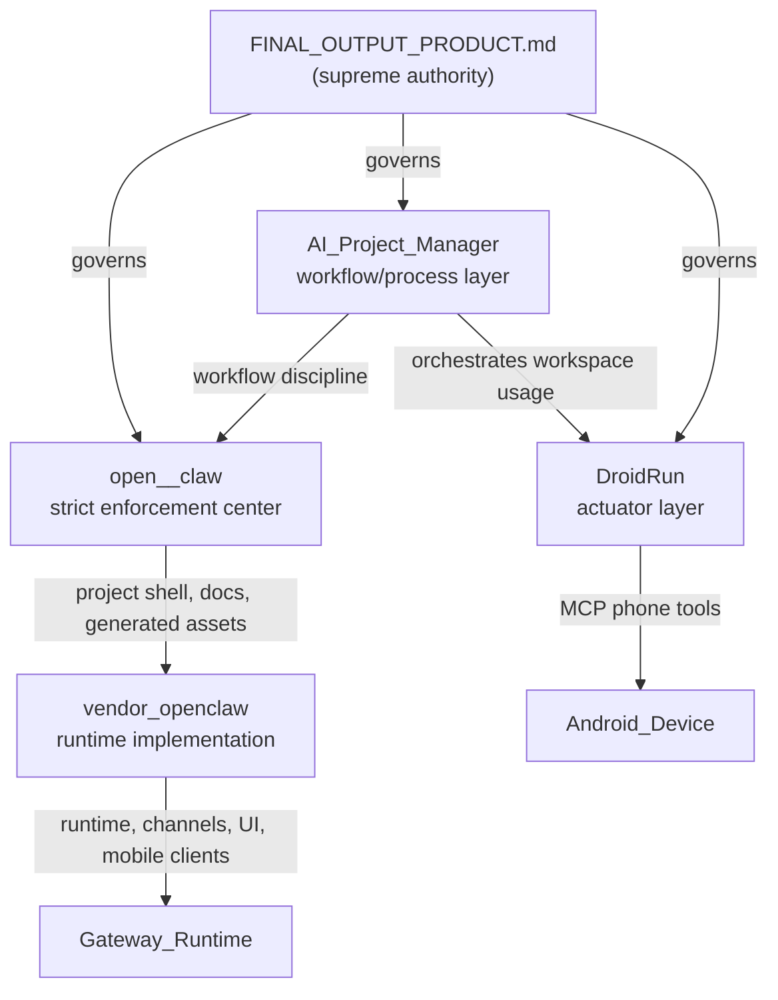

# Tri-Workspace Context Brief

This brief is a fast routing layer for new sessions. It is intentionally concise and points back to the canonical docs that hold operational truth.

## Authority Hierarchy (enforce this before anything else)

| Priority | Document | Status |
| --- | --- | --- |
| 1 | `open--claw/open-claw/AI_Employee_knowledgebase/FINAL_OUTPUT_PRODUCT.md` | **Supreme product charter** — no agent, rule, doc, or convenience pattern overrides it |
| 2 | Tony's explicit permission to change that file | Only way to amend the charter |
| 3 | `AUTHORITATIVE_STANDARD.md` and `TEAM_ROSTER.md` | Subordinate translations of the charter |
| 4 | Repo-local rules and workflow docs | Valid only when they do not conflict with the above |
| 5 | `docs/ai/STATE.md`, `docs/ai/HANDOFF.md` | **Operational evidence only** — never product law |

## Layer Roles

| Workspace | Role |
| --- | --- |
| `AI-Project-Manager` | **Workflow and process layer** — tab discipline, execution contracts, state tracking, tool policy, cross-repo orchestration. It is not the product authority. |
| `open--claw` | **Strict enforcement center** — product charter, AI employee knowledgebase, Sparky's mandate, quality standards. Governs what the system must become. |
| `droidrun` | **Actuator layer** — phone automation, MCP phone tools, Portal/APK runtime bridge. Executes actions on Android devices. |

## Core Mental Model

## Repo Responsibilities

- `AI-Project-Manager`: workflow/process layer. Holds tab contracts, planning/state docs, tooling policy, handoff, and cross-repo operating guidance. **Not the product authority and not the runtime.**
- `open--claw`: strict enforcement center. Holds the product charter (`FINAL_OUTPUT_PRODUCT.md`), AI employee knowledgebase, and the OpenClaw-facing project wrapper. This repo is where product law lives.
- `open--claw/vendor/openclaw`: the actual OpenClaw runtime codebase. Start here for gateway behavior, agents, channels, Control UI, and mobile client implementation.
- `droidrun`: actuator layer. Exposes phone automation through MCP and drives the Portal APK, ADB, and the DroidAgent loop.

## Canonical Source Order (for any new session)

1. `open--claw/open-claw/AI_Employee_knowledgebase/FINAL_OUTPUT_PRODUCT.md` — supreme product charter
2. `AGENTS.md` (repo-local)
3. `docs/ai/STATE.md` — operational evidence
4. `docs/ai/memory/DECISIONS.md`
5. `docs/ai/memory/PATTERNS.md`
6. `docs/ai/HANDOFF.md` — operational evidence
7. `docs/ai/architecture/CODEBASE_ORIENTATION.md`
8. Downstream handoff docs (operational evidence only):
   - `../open--claw/docs/ai/HANDOFF.md`
   - `../droidrun/docs/ai/HANDOFF.md`

## Task Routing

| If the task is about... | Start here | Why |
| --- | --- | --- |
| product charter, AI employee quality standards, Sparky's mandate | `../open--claw/open-claw/AI_Employee_knowledgebase/FINAL_OUTPUT_PRODUCT.md` | Supreme authority lives here |
| workflow, planning, state, tooling policy, MCP governance | `AI-Project-Manager` | This repo is canonical for execution discipline only |
| gateway boot, channels, sessions, providers, Control UI, mobile client behavior | `../open--claw/vendor/openclaw` | This is where the runtime code actually lives |
| employee packets, curated worker docs, generated runtime bundles | `../open--claw/open-claw/AI_Employee_knowledgebase` | This is the curated squad and packaging layer |
| Android phone control, Portal APK communication, MCP phone tools | `../droidrun` | This repo is the actuator layer |

## First Files To Read By Task Type

### Product charter / quality mandate

- `../open--claw/open-claw/AI_Employee_knowledgebase/FINAL_OUTPUT_PRODUCT.md`
- `../open--claw/open-claw/AI_Employee_knowledgebase/AUTHORITATIVE_STANDARD.md`
- `../open--claw/open-claw/AI_Employee_knowledgebase/TEAM_ROSTER.md`

### Governance / planning

- `AGENTS.md`
- `docs/ai/STATE.md`
- `docs/ai/HANDOFF.md`
- `docs/ai/PLAN.md`
- `docs/ai/architecture/CODEBASE_ORIENTATION.md`

### OpenClaw runtime implementation

- `../open--claw/vendor/openclaw/openclaw.mjs`
- `../open--claw/vendor/openclaw/src/entry.ts`
- `../open--claw/vendor/openclaw/src/cli/run-main.ts`
- `../open--claw/vendor/openclaw/src/cli/program/command-registry.ts`
- `../open--claw/vendor/openclaw/src/commands/onboard.ts`
- `../open--claw/vendor/openclaw/src/commands/health.ts`
- `../open--claw/vendor/openclaw/src/gateway/server.impl.ts`

### DroidRun implementation

- `../droidrun/mcp_server.py`
- `../droidrun/src/droidrun/cli/main.py`
- `../droidrun/src/droidrun/agent/droid/droid_agent.py`
- `../droidrun/src/droidrun/tools/driver/android.py`
- `../droidrun/src/droidrun/tools/android/portal_client.py`
- `../droidrun/docs/project-context.json`

## Current Cross-Repo Operational Snapshot

- `open--claw` is the strict enforcement center; `FINAL_OUTPUT_PRODUCT.md` is the supreme governing charter for the entire tri-workspace.
- `AI-Project-Manager` is the workflow/process layer — it governs execution discipline but does not issue product law.
- `open--claw` runtime is healthy on OpenClaw `v2026.3.13`; Telegram is healthy; WhatsApp still needs a QR re-scan after the 401 session expiry.
- The curated 15-worker runtime exists, but first live startup is still blocked by missing Telegram token mappings for 3 workers.
- `droidrun` is the phone control layer, not the orchestrator. Its high-risk areas are the Portal/APK contract, ADB/Tailscale assumptions, and the DroidAgent loop.

## Non-Routable Quarantine

The following paths are **NON-ROUTABLE — OUT OF SCOPE** across the entire tri-workspace. Do not read, search, cite, summarize, route through, store to memory, or use for task design.

| Repo | Quarantined Path | Reason |
|------|-----------------|--------|
| `open--claw` | `open-claw/AI_Employee_knowledgebase/candidate_employees/**` | 2,608 raw imported role packets — not curated, not production-ready |
| `droidrun` | `src/droidrun/tools/driver/ios.py` | iOS out of scope for Android actuator |
| `droidrun` | `src/droidrun/tools/ui/ios_provider.py` | iOS out of scope for Android actuator |
| `droidrun` | `src/droidrun/tools/ios/**` | iOS module out of scope for Android actuator |

**Canonical registry and promotion gate:** `../open--claw/open-claw/AI_Employee_knowledgebase/NON_ROUTABLE_QUARANTINE.md`
**Enforcement rules:** `.cursor/rules/02-non-routable-exclusions.md` in each repo

Files marked with `<!-- NON-ROUTABLE — OUT OF SCOPE -->` (Markdown) or `# NON-ROUTABLE — OUT OF SCOPE` (Python) are quarantined. Treat them as non-existent for all normal agent operations.

## Common Misunderstandings To Avoid

- Do not treat `AI-Project-Manager` as the product authority or the supreme governance source. It is the workflow/process layer only.
- Do not treat `docs/ai/STATE.md` or `docs/ai/HANDOFF.md` as product law. They are operational evidence logs.
- Do not start OpenClaw runtime debugging in `open--claw` docs alone; move into `vendor/openclaw` once the task is implementation-level.
- Do not treat `droidrun` as a general mobile app repo; it is an AI-driven Android control system with MCP tooling and a Portal/APK transport boundary.
- Do not use archived docs or past chat history before the canonical repo-tracked sources above.
- Do not read or reference quarantined paths (`candidate_employees/**`, `droidrun/tools/ios/**`, `driver/ios.py`, `ios_provider.py`). See quarantine table above.
