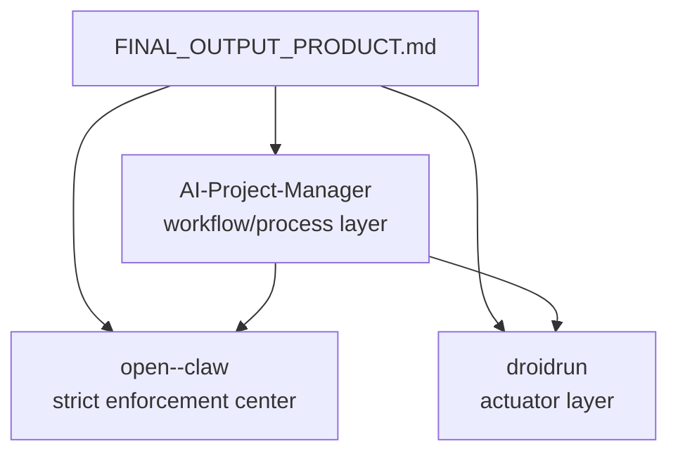

# Tri-Workspace Tool Workflow

This document defines the active tool-routing model for the managed tri-workspace:

- `AI-Project-Manager`
- `open--claw`
- `droidrun`

It is grounded in the MCP descriptors currently installed under `mcps/`, not in older or aspirational tool inventories.

## Why This Exists

The tri-workspace has three distinct roles:

- `AI-Project-Manager` owns workflow, orchestration, recovery policy, and tool discipline
- `open--claw` owns product enforcement and OpenClaw runtime implementation
- `droidrun` owns Android actuator behavior and phone automation

The workflow must therefore keep authority clear, scope tools to the active repo/task, and prevent hidden global overlays from silently outranking repo-tracked governance.

## Authority Flow

- The charter governs all three repos.
- `AI-Project-Manager` governs workflow and tool discipline, not product law.
- `open--claw` governs runtime/product enforcement.
- `droidrun` executes actuator-specific work after handoff.

## Repo Responsibilities

| Repo | Responsibility | What it should own |
|---|---|---|
| `AI-Project-Manager` | workflow/process layer | plans, tool policy, state, handoff, cross-repo orchestration |
| `open--claw` | enforcement/runtime layer | product enforcement, OpenClaw runtime code, quality gates |
| `droidrun` | actuator layer | Android automation, device interaction, phone tooling |

## Lean Bootstrap Order

For recovery or non-trivial execution in any repo, use this lean path:

1. Read the charter first.
2. Read the repo authority contract for the repo actually in scope.
3. Run targeted OpenMemory retrieval for the active repo/task.
4. Read the recovery bundle via `filesystem`, if present and current.
5. Read the `STATE.md` summary/current state section.
6. Read exactly one of `DECISIONS.md`, `PATTERNS.md`, or `HANDOFF.md` if needed.
7. Use `docs/ai/context/AGENT_EXECUTION_LEDGER.md` only as a one-block-at-a-time fallback.

Other `docs/ai/context/` artifacts and chat history are not part of the default bootstrap path.

## Installed MCP Descriptors

The currently installed MCP descriptor set contains 9 servers:

| Server | Role |
|---|---|
| `Context7` | external library/framework/vendor docs |
| `thinking-patterns` | structured reasoning for non-trivial plan/debug/decision work |
| `openmemory` | durable compact recall/store |
| `filesystem` | recovery-bundle reads/writes and local file access in allowed directories |
| `serena` | exact-path code intelligence/navigation |
| `droidrun` | phone/device automation |
| `obsidian-vault` | optional sidecar notes and personal research |
| `Magic MCP` | UI/design scaffolding |
| `Artiforge` | synthesis/scaffold drafting after canonical reads |

If a tool is not in this list, it is not part of the active installed MCP surface for this workspace.

## Tool Boundaries

### `serena`

`serena` is project-bound and must switch by exact path.

| Work in scope | Serena path |
|---|---|
| `AI-Project-Manager` code/config | `D:/github/AI-Project-Manager` |
| OpenClaw runtime code | `D:/github/open--claw/open-claw` |
| DroidRun code | `D:/github/droidrun` |

Rules:

- Never rely on dashboard names alone.
- Never treat `D:/github/open--claw` repo root as the primary Serena code project.
- If the task is docs-only, Serena is not applicable.
- If Serena is required and unavailable, stop and notify the user.

### `Context7`

Use `Context7` only for external libraries, frameworks, SDKs, CLIs, and cloud services.

- `open--claw`: runtime dependencies and platform docs
- `droidrun`: Android/Python/device-tool dependencies
- `AI-Project-Manager`: Cursor/MCP/tooling/library docs

It is never project truth.

### `thinking-patterns`

This is the primary structured reasoning tool.

Use it for:

- debugging: `debugging_approach`
- architecture/system design: `mental_model`, `domain_modeling`
- cross-repo reasoning: `problem_decomposition`, `structured_argumentation`
- trade-offs: `decision_framework`, `critical_thinking`
- linear planning when appropriate: `sequential_thinking`

`sequential-thinking` is not part of the supported toolchain anymore.

### `openmemory`

OpenMemory is the primary durable structured recall layer after the charter and repo authority docs.

Verified live surface:

- `search-memories(query)`
- `list-memories()`
- `add-memory(content)`

Because the surface is flat:

- do not assume `project_id`, `namespace`, `memory_types`, or metadata filters
- use compact self-identifying text instead
- store only validated durable findings, not raw transcripts or copied docs

### `filesystem`

Use `filesystem` for the recovery bundle and other allowed local-file operations.

The AI-PM recovery bundle is limited to:

- `docs/ai/recovery/current-state.json`
- `docs/ai/recovery/session-summary.md`
- `docs/ai/recovery/active-blockers.json`
- `docs/ai/recovery/memory-delta.json`

It is a non-canonical speed layer only.

### `obsidian-vault`

Use `obsidian-vault` only when the task explicitly needs operator notes or personal research already known to live there.

- sidecar-only
- non-canonical
- non-blocking when degraded
- never a default bootstrap source

### `Magic MCP`

Use `Magic MCP` only when UI generation or design scaffolding is the actual task.

### `Artiforge`

Use `Artiforge` only after canonical repo reads, and only for synthesis or scaffold drafts.

It never defines policy.

### `droidrun`

Use `droidrun` for phone/device interaction and Android actuator work.

## Non-Installed MCP Capabilities

The current installed descriptor set does **not** include MCP servers for:

- GitHub repo operations
- general web research/search
- web extraction/scraping
- browser automation
- context-matic API integration

When those capabilities are needed, rely on the approved built-in fallbacks or install the missing MCP descriptors before changing the governance docs to depend on them.

## MCP Configuration

Active MCP server configuration lives in the single global config:

- `C:/Users/ynotf/.cursor/mcp.json`

No workspace-local `.cursor/mcp.json` files should be used in the tri-workspace. The earlier split caused duplicate tool loading across sibling repos.

## No-Loss Memory Integration

See `docs/ai/architecture/NO_LOSS.md`, `docs/ai/operations/NO_LOSS_RECOVERY_LOOP.md`, and `docs/ai/memory/MEMORY_CONTRACT.md`.

- OpenMemory is the durable compact recall/store layer.
- The recovery bundle is the filesystem speed layer.
- `STATE.md` and `HANDOFF.md` are operational evidence, not first authority.
- Obsidian stays sidecar-only.
- Durable promotion uses compact self-identifying text, not unsupported metadata fields.

## Required Behavior When Tools Are Missing

If a required tool is disabled, unavailable, or failing:

1. Announce the failure immediately.
2. Name the exact tool and failed step.
3. State why the tool is required for the current task.
4. State whether a safe fallback exists.
5. If a safe fallback exists, use it explicitly and record the evidence gap or reseed debt.
6. If a safe fallback does not exist, stop and ask for restoration.
7. Record the incident in `docs/ai/STATE.md`.

Do not silently continue or pretend an unavailable tool was used.

## Final Working Model

The active clean model is:

- one charter
- three repos with strict responsibilities
- one shared tri-workspace MCP config
- a 9-server installed MCP surface
- exact-path Serena activation
- flat OpenMemory semantics
- sidecar-only Obsidian
- filesystem recovery bundle as a non-canonical speed layer
- explicit fail/fallback behavior instead of silent downgrade
