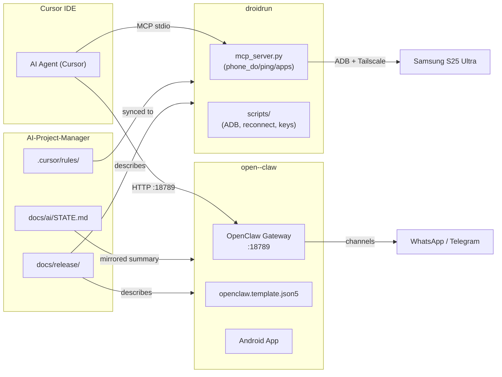

# Repo Boundaries & Responsibility Map

**Version:** Internal v1.0  
**Last updated:** 2026-03-16  
**Source:** Real repo structures as of 2026-03-16

---

## Overview: Three-Layer Architecture

```
┌─────────────────────────────────────────────────────────────┐
│  AI-Project-Manager  (Layer 3 — Orchestration)              │
│  Who owns governance, plans, rules, and cross-repo docs     │
├─────────────────────────────────────────────────────────────┤
│  open--claw          (Layer 2 — Agent Brain)                │
│  Who owns the AI gateway, channels, LLM routing, memory     │
├─────────────────────────────────────────────────────────────┤
│  droidrun            (Layer 1 — Runtime)                    │
│  Who owns phone automation, ADB bridge, MCP server          │
└─────────────────────────────────────────────────────────────┘
```

Each layer depends on the layer below but does NOT import or modify it directly.
Communication is via MCP tools (Cursor → droidrun), HTTP API (Cursor → open--claw gateway),
and documentation contracts (AI-Project-Manager → both).

---

## AI-Project-Manager

### What It Owns
| Area | Path | Description |
|------|------|-------------|
| Workflow rules | `.cursor/rules/` | Cursor AI behavior rules (00, 05, 10, 20) |
| Project state | `docs/ai/STATE.md` | Rolling operational log — primary truth source |
| Phase plans | `docs/ai/PLAN.md` | Current phase and exit criteria |
| Architecture docs | `docs/ai/architecture/` | CODEBASE_ORIENTATION, OPENCLAW_MODULES, GOVERNANCE_MODEL, AUTONOMY_LOOPS |
| Memory artifacts | `docs/ai/memory/` | DECISIONS.md, PATTERNS.md |
| Tab prompts | `docs/ai/tabs/` | Bootstrap prompts for each Cursor tab mode |
| Release docs | `docs/release/` | This directory — all cross-cutting release artifacts |
| Tooling docs | `docs/tooling/` | MCP_CANONICAL_CONFIG.md |
| Archive | `docs/ai/archive/` | Superseded STATE.md entries (not consulted by PLAN) |

### When to Change AI-Project-Manager
- Changing workflow contracts (PLAN/AGENT/DEBUG/ASK/ARCHIVE tab behavior)
- Updating phase plans or exit criteria
- Adding governance rules for all three repos
- Documenting architectural decisions that span repos
- Adding or archiving STATE.md entries
- Updating release documentation

### What NOT to Put Here
- Runtime code of any kind (no Python, TypeScript, Node.js executables)
- Secrets or API keys
- Gateway configuration (`openclaw.json` lives in `~/.openclaw/` — local only, not in any repo)
- Android app code (belongs in open--claw)
- Phone automation scripts (belong in droidrun)

### Integration Contracts
- Publishes `.cursor/rules/` files that govern AI agent behavior in all three repos (rules are synced to `droidrun/.cursor/rules/`)
- `STATE.md` is the source of truth for current operational state — other repos mirror only a summary
- Release docs in `docs/release/` describe system-wide architecture that open--claw and droidrun must conform to

---

## open--claw

### What It Owns
| Area | Path | Description |
|------|------|-------------|
| Gateway runtime | `vendor/openclaw/` | OpenClaw v2026.3.8 distribution (pinned) |
| Gateway config template | `open-claw/configs/openclaw.template.json5` | Commit-safe template for `~/.openclaw/openclaw.json` |
| Android app | `vendor/openclaw/apps/android/` | Kotlin/Compose Android app (versionName 2026.3.8, minSdk 31, targetSdk 36) |
| Build scripts | `build_apk.bat`, `build_apk_release.bat` | Windows batch scripts for Android APK builds |
| Vendor pin | `docs/VENDOR_PIN.md` | Locked vendor version + rebuild instructions |
| State mirror | `docs/ai/STATE.md` | Concise mirror of AI-Project-Manager STATE.md |

### When to Change open--claw
- Updating the OpenClaw gateway version (update `vendor/openclaw/`, update `VENDOR_PIN.md`)
- Modifying the gateway configuration template (`openclaw.template.json5`)
- Building or releasing the Android app (`build_apk.bat`)
- Adding OpenClaw skills or channel configurations to the template

### What NOT to Put Here
- Governance rules (`.cursor/rules/` for all three repos is owned by AI-Project-Manager)
- Phone automation scripts (belong in droidrun)
- Secrets or API keys (gateway credentials live in `~/.openclaw/` — local only)
- DroidRun MCP server code

### Integration Contracts
- Gateway runs on WSL2 at `localhost:18789` (API/UI) and `localhost:18792` (health check)
- Cursor connects to the gateway via HTTP at `:18789`
- Channels (WhatsApp via Baileys, Telegram via grammy) are managed inside the gateway
- The `openclaw.json` config file lives at `~/.openclaw/openclaw.json` (WSL) — never committed to git
- LLM routing: primary `anthropic/claude-sonnet-4-5`, fallback `openai/gpt-4o`, budget `openai/gpt-4o-mini`
- Skills defined in `openclaw.template.json5 → skills.entries` are the authoritative skill registry
- The Android app (`apps/android/`) is a companion mobile client (AI-direct terminal) — it is NOT the WhatsApp channel; that is Baileys
- Android signing properties (`OPENCLAW_ANDROID_STORE_FILE`, etc.) must be set in `~/.gradle/gradle.properties` — never committed

### Key Files (not in repo — local only)
| File | Location | Purpose |
|------|----------|---------|
| `openclaw.json` | `~/.openclaw/openclaw.json` (WSL) | Live gateway config |
| `.env` | `~/.openclaw/.env` (WSL) | Low-risk channel tokens (TELEGRAM_BOT_TOKEN, etc.) |
| `.gateway-env` | `~/.openclaw/.gateway-env` (WSL, transient) | API keys during systemd service restart only |
| `paired.json` | `~/.openclaw/devices/` (WSL) | Paired node device registry |

---

## droidrun

### What It Owns
| Area | Path | Description |
|------|------|-------------|
| MCP server | `mcp_server.py` | Exposes phone_do / phone_ping / phone_apps via MCP stdio |
| Source library | `src/` | git submodule → github.com/droidrun/droidrun (upstream) |
| Python venv | `.venv/` | Python 3.12.10 virtual environment (not committed) |
| Scripts | `scripts/` | ADB reconnect, key injection, MCP server startup |
| Architecture docs | `docs/architecture_overview.md` | Device info, secret injection, network topology |
| Environment docs | `docs/environment-config-reference.md` | YAML config + env var reference |
| Cursor rules | `.cursor/rules/` | Synced from AI-Project-Manager (do not edit directly here) |

### When to Change droidrun
- Updating `mcp_server.py` (adding MCP tools, changing AI provider logic, updating device target)
- Updating scripts in `scripts/` (ADB reconnect, port finding, key injection)
- Upgrading the DroidRun library (update `src/` submodule pointer)
- Adding documentation specific to phone automation

### What NOT to Put Here
- OpenClaw gateway code or config (belongs in open--claw)
- Governance rules (rules are synced from AI-Project-Manager — edit source there, not here)
- Secrets (API keys are in Bitwarden Secrets Manager, injected at runtime)
- The DroidRun Portal APK source (that lives in the upstream github.com/droidrun/droidrun repo)

### Integration Contracts
- MCP server starts via `scripts/start_mcp_server.ps1` (spawned by Cursor/OpenClaw/Claude Desktop as a subprocess)
- Three MCP tools exposed: `phone_do(task, vision)`, `phone_ping()`, `phone_apps()`
- Default device: `100.71.228.18:5555` (Samsung S25 Ultra, Tailscale IP — stable, does not change)
- ADB port forward: `adb -s 100.71.228.18:5555 forward tcp:8080 tcp:8080` required before portal comms
- AI provider selection: no-vision → DeepSeek (`deepseek-chat`); vision → OpenRouter (`google/gemini-2.0-flash-001`)
- Secrets read from Windows user env vars: `DROIDRUN_DEEPSEEK_KEY`, `DROIDRUN_OPENROUTER_KEY`
- `.cursor/rules/` are sourced from AI-Project-Manager — sync changes there first, then copy here

---

## Cross-Repo Integration Map



---

## Decision Log: Why This Boundary Design

| Decision | Rationale |
|----------|-----------|
| AI-Project-Manager owns all `.cursor/rules/` | Single source of truth prevents rule drift across repos |
| droidrun `.cursor/rules/` are synced copies | Rules must work in droidrun's Cursor workspace context; sync manually when AI-PM rules change |
| Gateway config (`openclaw.json`) is never in git | Contains internal auth token; OpenClaw manages it; only the template is committed |
| droidrun `src/` is a git submodule | Separates upstream library from our customizations; allows upstream updates via submodule pull |
| release docs live in AI-Project-Manager | Orchestration layer owns cross-cutting docs; avoids duplication in open--claw and droidrun |
| Secrets never in any repo | Bitwarden injection at startup; transient .gateway-env deleted after 8 seconds |
