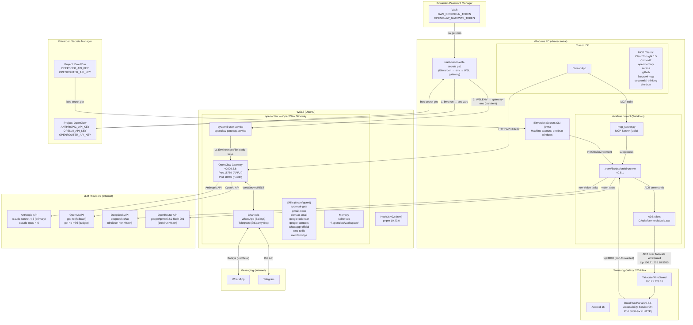
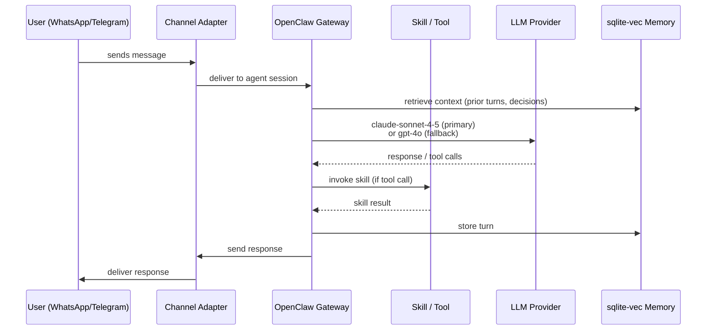
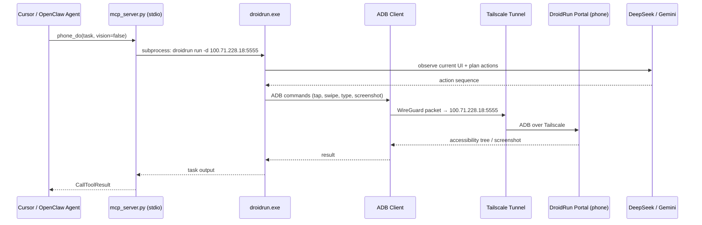

# System Architecture

**Version:** OpenClaw v2026.3.8 / DroidRun v0.5.1  
**Last updated:** 2026-03-16  
**Audience:** Internal — owner, family, employees  
**Source repos:** open--claw, droidrun, AI-Project-Manager

---

## Overview

This is a tri-project AI operating system running on a single Windows PC (chaoscentral) with WSL2.
The system provides always-on AI assistance through messaging channels (WhatsApp, Telegram),
developer tooling (Cursor IDE), and physical phone automation (Samsung Galaxy S25 Ultra).

### Three-Layer Stack

```
┌─────────────────────────────────────────────────────────────────────┐
│  Layer 3: ORCHESTRATION — AI-Project-Manager                        │
│  Governance rules, workflow contracts, release docs, STATE.md       │
│  No runtime. Docs-only repo. Cursor rules define AI behavior.       │
├─────────────────────────────────────────────────────────────────────┤
│  Layer 2: AGENT BRAIN — open--claw (WSL2)                           │
│  OpenClaw v2026.3.8 gateway. Port 18789 (UI/API), 18792 (health)   │
│  Channels: WhatsApp (Baileys), Telegram. Skills: 8 configured.      │
│  LLM routing: claude-sonnet-4-5 → gpt-4o → gpt-4o-mini             │
│  Memory: sqlite-vec (local vector store). Node.js 22, pnpm.         │
├─────────────────────────────────────────────────────────────────────┤
│  Layer 1: RUNTIME — droidrun (Windows)                              │
│  Python 3.12.10. MCP server: phone_do / phone_ping / phone_apps    │
│  Target: Samsung Galaxy S25 Ultra (Android 16) via ADB+Tailscale   │
│  Tailscale IP: 100.71.228.18:5555. DroidRun Portal v0.6.1 on phone │
└─────────────────────────────────────────────────────────────────────┘
```

---

## Full System Architecture Diagram



---

## Data Flow: User Message → Agent Response



---

## Data Flow: Phone Control



---

## Service Boundaries

| Service | Host | Port | Protocol | Owner |
|---------|------|------|----------|-------|
| OpenClaw Gateway API | WSL2 localhost | 18789 | HTTP/WebSocket | open--claw |
| OpenClaw Health | WSL2 localhost | 18792 | HTTP | open--claw |
| OpenClaw Control UI | WSL2 localhost | 18789/openclaw | HTTP | open--claw |
| DroidRun MCP Server | Windows process | stdio | MCP JSON-RPC | droidrun |
| OpenMemory Proxy | Windows localhost | 8766 | HTTP/SSE | AI-Project-Manager |
| ADB Server | Windows | 5037 | TCP | droidrun |
| DroidRun Portal | Phone (Android) | 8080 | HTTP (port-forwarded) | droidrun |
| Tailscale VPN | Windows + Phone | WireGuard | UDP | external |

---

## Repo Responsibilities (Summary)

| Repo | Runtime | Language | Primary Role |
|------|---------|----------|-------------|
| `open--claw` | WSL2 | Node.js 22 | AI gateway, channels, LLM routing, skills, memory |
| `droidrun` | Windows | Python 3.12 | Phone automation, ADB bridge, MCP server |
| `AI-Project-Manager` | None | Markdown | Governance, workflow rules, release docs, STATE tracking |

---

## Local vs. Remote Execution

| Component | Local | Remote/Cloud |
|-----------|-------|-------------|
| OpenClaw gateway process | ✓ WSL2 | — |
| Agent session state | ✓ sqlite-vec on disk | — |
| LLM inference | — | ✓ Anthropic / OpenAI / OpenRouter / DeepSeek |
| WhatsApp messages | ✓ Baileys runs locally | ✓ WhatsApp servers for delivery |
| Telegram messages | ✓ grammy runs locally | ✓ Telegram Bot API |
| DroidRun MCP server | ✓ Windows process | — |
| ADB connection | ✓ Windows → Phone via Tailscale | ✓ Tailscale relay if P2P fails |
| Secret storage | — | ✓ Bitwarden cloud vault |

---

## Offline Support

| Feature | Works Offline? | Notes |
|---------|----------------|-------|
| OpenClaw gateway process | ✓ Yes | Starts without internet |
| Local memory (sqlite-vec) | ✓ Yes | Reads/writes work offline |
| LLM responses | ✗ No | All LLM providers are cloud APIs |
| WhatsApp / Telegram | ✗ No | Requires internet for delivery |
| DroidRun phone control | Partial | ADB works over LAN; Tailscale relay needs internet |
| Bitwarden secret injection | ✗ No | bws requires internet; use cached env vars |

---

## Startup Sequence

When `start-cursor-with-secrets.ps1` is run (via `bws run ...`):

1. **Bitwarden bws CLI** injects secrets into PowerShell env vars (ANTHROPIC_API_KEY, OPENAI_API_KEY, OPENROUTER_API_KEY)
2. **DroidRun block**: fetches DEEPSEEK_KEY + OPENROUTER_KEY from DroidRun Bitwarden project; stores in Windows user env; reconnects phone ADB
3. **OpenMemory proxy**: starts `start-openmemory-proxy.ps1` (HTTP→SSE bridge on :8766)
4. **Gateway secrets**: writes transient `~/.openclaw/.gateway-env` (chmod 600), restarts `openclaw-gateway.service` via systemd, deletes `.gateway-env` after 8 seconds
5. **Cursor launches**: opens `openclaw.code-workspace` (AI-Project-Manager + open--claw + droidrun)

---

## MCP Servers Active in Cursor

| Server | Transport | Purpose |
|--------|-----------|---------|
| `Clear Thought 1.5` | HTTP | Primary reasoning (mental_model, debugging_approach, etc.) |
| `Context7` | HTTP | Library/framework documentation lookup |
| `openmemory` | HTTP (:8766) | Cross-session agent memory |
| `serena` | stdio | Code intelligence (symbol nav, refactoring) |
| `github` | HTTP | GitHub repo operations |
| `sequential-thinking` | stdio | Fallback sequential reasoning |
| `firecrawl-mcp` | HTTP | Web scraping (scrape/map/search only) |
| `droidrun` | stdio | Phone automation (phone_do/phone_ping/phone_apps) |

---

## Key Configuration Files

| File | Location | Purpose |
|------|----------|---------|
| `openclaw.json` | `~/.openclaw/openclaw.json` (WSL) | Gateway runtime config (channels, agents, skills, routing) |
| `openclaw.template.json5` | `open--claw/open-claw/configs/` | Template for `openclaw.json` — commit-safe |
| `mcp.json` | `C:\Users\ynotf\.cursor\mcp.json` | Cursor MCP server registry |
| `openclaw.code-workspace` | `C:\Users\ynotf\.openclaw\` | Tri-repo multi-root workspace definition |
| `start-cursor-with-secrets.ps1` | `C:\Users\ynotf\.openclaw\` | Startup script (Bitwarden → env → gateway) |
| `api-keys.conf` | `~/.config/systemd/user/openclaw-gateway.service.d/` | systemd EnvironmentFile drop-in |
| `mcp_server.py` | `D:\github\droidrun\` | DroidRun MCP server entry point |

> **Security:** No secrets are stored in any of these files (except `openclaw.json`'s internal gateway auth token, which is OpenClaw-managed and not a user-provided credential).
