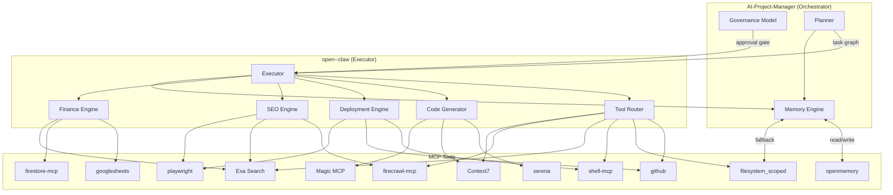

# open--claw Module Architecture

**Last updated:** 2026-02-23
**Author:** Agent (Phase 6A)
**Research basis:** Exa Search — openclawlab.com official docs, Bibek Poudel (Medium), Raj (Substack), openclawlaunch.com MCP guide

---

## Overview

open--claw is a **local-first, always-on AI operations assistant** built on the Gateway architecture.
The system is decomposed into 8 core modules that map to OpenClaw's documented layers:

```
Ingress → Control Plane → Execution Plane → Capability Layer → Data Layer
```

AI-Project-Manager acts as the **orchestrator/governance overlay** — it defines plans, approval
gates, and memory contracts. open--claw acts as the **executor** — it runs Gateway, receives
tasks, and invokes tools.

---

## Module Definitions

### Module: Planner

**Purpose:** Decomposes high-level user goals into ordered, executable task graphs with defined
success criteria and failure branches.

**Inputs:**
- User goal (natural language, from AI-Project-Manager PLAN or WhatsApp/Telegram channel)
- Prior decisions from Memory Engine
- Current system state (active tasks, resource availability)

**Outputs:**
- Structured task graph (ordered steps, dependencies, expected outputs)
- Risk classification per step (Low / Medium / High)
- Estimated token budget per step

**Dependencies:**
- Memory Engine (retrieve prior plans, avoid repeating failed approaches)
- Tool Router (verify which tools are available before committing to a plan)

**MCP tools used:**
- `thinking-patterns` (multi-step reasoning for complex plans)
- `openmemory` (retrieve prior decisions, active context)
- `serena` (codebase context for code-related plans)

**Risk level:** Low — planning does not execute side effects.

---

### Module: Executor

**Purpose:** Drives the agentic run/attempt lifecycle — iterates over a task graph, dispatches
steps to the appropriate module, tracks completion, and handles retries.

**Inputs:**
- Task graph from Planner
- Tool results from Tool Router
- Approval signals from Governance overlay (for High-risk steps)

**Outputs:**
- Step-by-step execution trace (logged to audit store)
- Final result or escalation report
- Updated task graph (marking completed/failed steps)

**Dependencies:**
- Tool Router (all tool invocations route through it)
- Planner (re-plan on failure)
- Memory Engine (log decisions after each step)
- Governance Model (gate checks before High-risk actions)

**MCP tools used:**
- built-in `Shell` (shell command execution)
- built-in file tools within allowed paths
- `github` (repo operations)

**Risk level:** Medium — executor drives side effects; gated per step risk level.

---

### Module: Tool Router

**Purpose:** Selects the optimal MCP tool for a given capability request, applies fallback logic
when a preferred tool is unavailable, and enforces rate limits.

**Inputs:**
- Capability request (e.g., "search web", "read file", "scrape URL")
- Current tool health status (available / rate-limited / errored)
- Task risk level (influences whether fallback is acceptable)

**Outputs:**
- Tool invocation result
- Tool health update (PASS/FAIL evidence)
- Fallback trace (if preferred tool was unavailable)

**Dependencies:**
- None (foundational module — all others depend on it)

**MCP tools used:**
- All configured MCP servers (selects dynamically):
  `Context7`, `Exa Search`, `firecrawl-mcp`, `github`, `playwright`,
  `Magic MCP`, `openmemory`, `thinking-patterns`, `serena`

**Risk level:** Low — routing itself has no side effects; the invoked tool carries the risk.

---

### Module: Memory Engine

**Purpose:** Provides cross-session persistence — stores decisions, patterns, and stable facts;
retrieves relevant prior context before planning or execution.

**Inputs:**
- Facts, decisions, and patterns from Planner, Executor, and all domain modules
- Query from any module requesting prior context

**Outputs:**
- Stored memories (with project scoping: `ynotfins/AI-Project-Manager`)
- Retrieved memory set (ranked by relevance)
- Memory taxonomy classification (component / implementation / debug / project_info / user_preference)

**Dependencies:**
- None (foundational — all modules can write to and read from it)

**MCP tools used:**
- `openmemory` (primary: add-memory, search-memory, list-memories, delete-memory)
- `docs/ai/memory/` file system (fallback: DECISIONS.md, PATTERNS.md, MEMORY_CONTRACT.md)

**Risk level:** Low — memory operations are non-destructive by default; delete-memory is Medium.

---

### Module: Code Generator

**Purpose:** Produces production-quality code (with tests) from a specification, following project
coding standards and existing patterns.

**Inputs:**
- Code specification (from Planner or user)
- Existing codebase context (symbols, patterns, imports)
- Language/framework targets (TypeScript, Python, Kotlin, etc.)

**Outputs:**
- Generated source files
- Corresponding test files
- PR description (for Deployment Engine)

**Dependencies:**
- Executor (orchestrates generation steps)
- Memory Engine (retrieve coding patterns and past decisions)
- Tool Router (filesystem and GitHub access)

**MCP tools used:**
- `serena` (symbol navigation, find references, replace symbol body)
- `filesystem_scoped` (read/write source files)
- `Context7` (verify library/framework usage before generating imports)
- `Magic MCP` (UI component generation)

**Risk level:** Low (staging) / High (direct production write) — see Governance Model.

---

### Module: Deployment Engine

**Purpose:** Executes build → deploy → monitor loop for applications; verifies health after each
deploy and rolls back on failure.

**Inputs:**
- Build artifact or source reference from Code Generator
- Target environment (staging / production)
- Approval signal (required for production — see Governance Model)

**Outputs:**
- Deployment status (PASS / FAIL)
- Health check result
- Rollback confirmation (if triggered)
- Audit log entry

**Dependencies:**
- Executor (drives the deployment loop)
- Tool Router (shell commands, GitHub Actions)
- Governance Model (mandatory gate for production deploys)
- Memory Engine (record deployment outcomes)

**MCP tools used:**
- built-in `Shell` (build commands, CLI deploys)
- `github` (create branches, PRs, trigger workflows)
- `playwright` (verify deployed UI health)
- built-in file tools (read config, write deploy manifests)

**Risk level:** Medium (staging) / High (production) — explicit approval required for production.

---

### Module: SEO Engine

**Purpose:** Crawls target sites, analyzes on-page and technical SEO, generates fixes (meta tags,
structured data, content improvements), deploys them, and verifies ranking impact.

**Inputs:**
- Target URLs (from user or scheduled trigger)
- SEO ruleset (from AI-Project-Manager governance docs)
- Current ranking data (from external APIs or crawl)

**Outputs:**
- SEO audit report (issues ranked by impact)
- Applied fixes (code changes or content patches)
- Post-fix crawl verification result
- Ranking delta report

**Dependencies:**
- Deployment Engine (deploy SEO fixes)
- Tool Router (web scraping, search API)
- Memory Engine (track prior audits, detect regressions)
- Governance Model (approve content changes before publish)

**MCP tools used:**
- `firecrawl-mcp` (crawl target URLs, extract structured data)
- `Exa Search` (competitor research, SERP data)
- `playwright` (render JavaScript-heavy pages, capture snapshots)
- `github` (PR for SEO code changes)

**Risk level:** Medium — content changes are reversible but affect live rankings.

---

### Module: Finance Engine

**Purpose:** Imports financial transactions, categorizes them, detects anomalies, generates
reports, and produces recommendations — operating exclusively in a funded bill-pay sandbox
(never touches savings or operating accounts directly).

**Inputs:**
- Transaction exports (CSV/JSON from bill-pay sandbox)
- Category ruleset (from AI-Project-Manager governance docs)
- Anomaly thresholds (configurable per account)

**Outputs:**
- Categorized transaction ledger
- Anomaly alert report
- Monthly/quarterly financial summary
- Actionable recommendations (with High-risk approval gate for any transactions)

**Dependencies:**
- Tool Router (file import, external API calls)
- Memory Engine (retain categorization rules, prior anomaly patterns)
- Governance Model (all financial transactions are High-risk — require explicit approval)
- Executor (orchestrates the import → categorize → detect → report pipeline)

**MCP tools used:**
- `filesystem_scoped` (read transaction exports)
- `user-googlesheets` (write summary reports to sheets)
- `user-firestore-mcp` (persist transaction records)
- `Exa Search` (look up merchant categorization)

**Risk level:** High — all financial output requires explicit human approval before action.

---

## Dependency Diagram



---

## Risk Summary

| Module | Risk Level | Reason |
|---|---|---|
| Planner | Low | Planning only — no side effects |
| Executor | Medium | Drives side effects; step-level gating |
| Tool Router | Low | Routing only; invoked tool carries risk |
| Memory Engine | Low | Non-destructive; delete is Medium |
| Code Generator | Low → High | Depends on target environment |
| Deployment Engine | Medium → High | Production deploys require approval |
| SEO Engine | Medium | Content changes affect live rankings |
| Finance Engine | High | All financial actions require approval |
