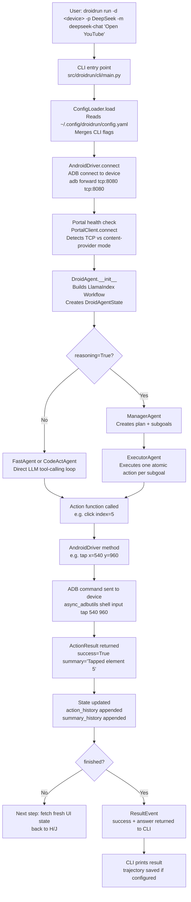
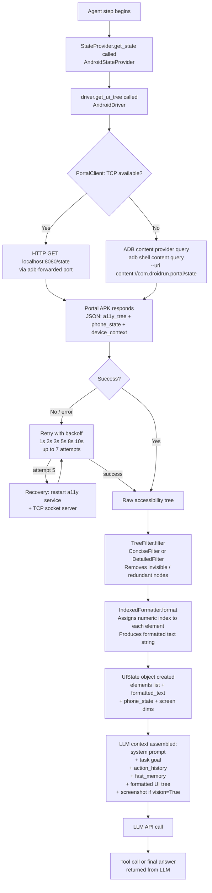
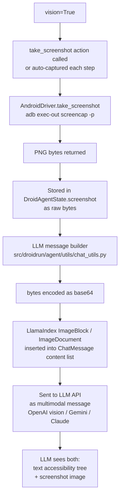
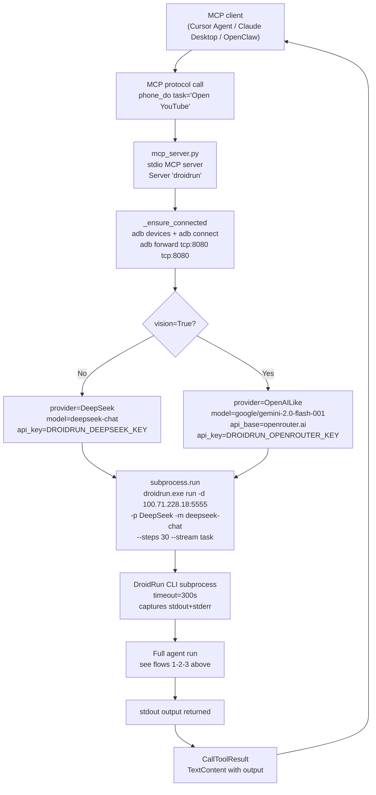
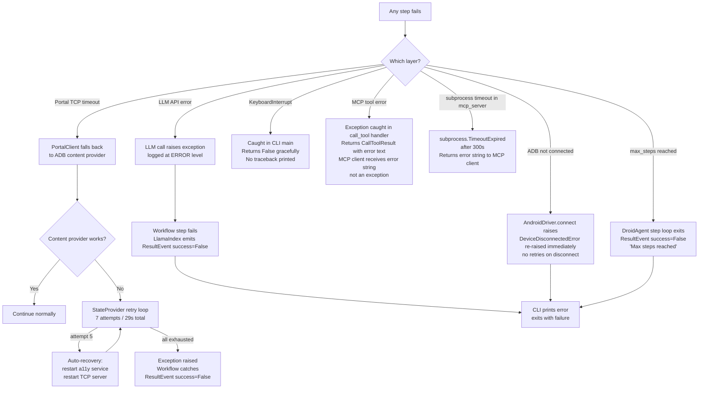

# Data Flow

This document traces the exact path data takes through DroidRun — from a user command to a physical tap on the device screen, and back.

---

## 1. User Input Flow (CLI → Action → Result)

---

## 2. UI Perception Flow (Request → LLM Context)

Each agent step starts by fetching the current device state. This is the "eyes" of the agent.

---

## 3. Vision Flow (Screenshot → Multimodal LLM Message)

Vision is **opt-in** (`--vision` flag or `tools.vision: true` in config). When enabled, a screenshot is captured and sent alongside the accessibility tree.

Notes:
- Without vision, the LLM relies entirely on the formatted accessibility tree text.
- With vision, both are sent. The LLM can use either to answer.
- Providers that do not support multimodal input (e.g., DeepSeek text-only) will fail if vision is enabled. Use a vision-capable model (Gemini, GPT-4o, Claude 3.x, etc.).

---

## 4. MCP Tool Flow (Cursor/Claude → Phone)

When DroidRun is used as an MCP server, the call chain is:

Tools exposed by `mcp_server.py`:

| Tool | What it does |
|---|---|
| `phone_do` | Run a natural language task (dispatches full DroidRun agent run) |
| `phone_ping` | `droidrun ping` — check Portal connectivity |
| `phone_apps` | `adb shell pm list packages -3` — list installed apps |

---

## 5. Error Flow (Failures and Fallbacks)

---

## End-to-End Timing Reference

| Segment | Typical latency |
|---|---|
| ADB connect + port forward | < 1s |
| Portal state fetch (TCP) | 50–200ms |
| Portal state fetch (content provider) | 200–800ms |
| TreeFilter + IndexedFormatter | < 10ms |
| LLM API call (DeepSeek, no vision) | 1–5s |
| LLM API call (Gemini vision) | 2–8s |
| ADB action execution (tap, swipe) | 100–500ms |
| Full step (fetch → LLM → act) | 2–10s |
| Full task (10 steps, no vision) | 20–100s |
