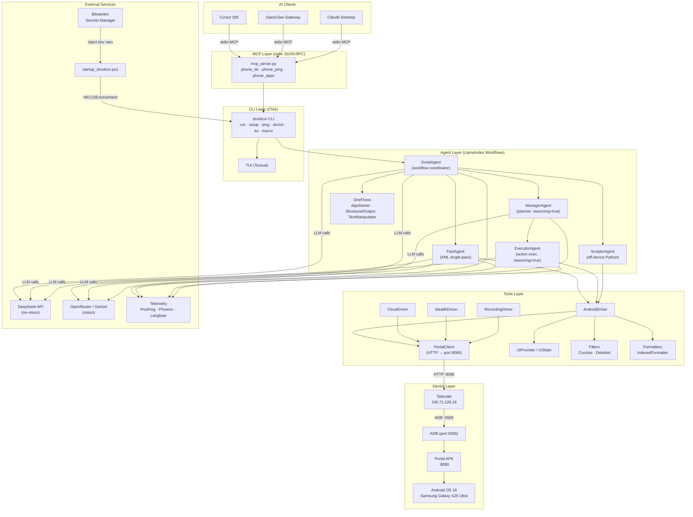
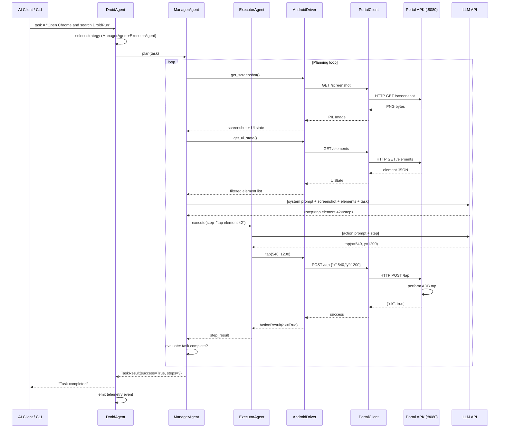

# DroidRun System Architecture

**Version:** 0.5.1 | **License:** MIT | **Runtime:** Python 3.11–3.13

---

## 1. Architecture Overview

DroidRun is an AI-driven Android automation framework that bridges large language model (LLM) reasoning with on-device action execution. The system is organized as a layered pipeline: AI clients (Cursor IDE, OpenClaw, Claude Desktop) issue natural-language tasks either through an MCP stdio server or directly via the CLI. The CLI instantiates a `DroidAgent` workflow coordinator, which selects one of three execution strategies — `FastAgent` (single-pass XML tools), or a `ManagerAgent` + `ExecutorAgent` pair (multi-step planning with reasoning). Every strategy ultimately calls an `AndroidDriver`, which wraps a `PortalClient` that communicates over HTTP (port 8080) with the **Portal APK** running on the Android device. ADB tunnels over Tailscale handle the physical transport layer. Secrets are never stored on disk; they are injected at startup from Bitwarden Secrets Manager via a PowerShell launcher. Telemetry is streamed asynchronously to PostHog, Arize-Phoenix, and optionally Langfuse.

---

## 2. Component Diagram



---

## 3. Observe–Plan–Act Sequence Diagram

The following sequence captures one complete loop: task reception → screen observation → LLM planning → action execution → result evaluation.



---

## 4. Service Boundaries

| Boundary | Protocol | Direction | Auth | Notes |
|---|---|---|---|---|
| AI Client → MCP Server | stdio JSON-RPC (MCP 1.26+) | bidirectional | process isolation | `mcp_server.py` exposes `phone_do`, `phone_ping`, `phone_apps` |
| CLI → Agent | Python function call | in-process | n/a | Click commands instantiate workflow objects directly |
| Agent → LLM API (DeepSeek) | HTTPS REST | outbound | `DROIDRUN_DEEPSEEK_KEY` env var | No vision; text-only tasks |
| Agent → LLM API (OpenRouter/Gemini) | HTTPS REST | outbound | `DROIDRUN_OPENROUTER_KEY` env var | Vision-capable; screenshot analysis |
| AndroidDriver → PortalClient | Python method call | in-process | n/a | `PortalClient` is a thin `httpx` wrapper |
| PortalClient → Portal APK | HTTP/1.1 | outbound | none (LAN-only) | Port 8080 on device IP; no TLS |
| PortalClient → Device | Tailscale overlay | outbound | Tailscale node key | Device IP: `100.71.228.18` |
| ADB → Android OS | ADB protocol TCP | outbound | ADB RSA key pair | Port 5555; device must have ADB over network enabled |
| DroidAgent → Telemetry | HTTPS | outbound | PostHog project key | Async; non-blocking; can be disabled |
| Bitwarden → PowerShell | Bitwarden SDK | outbound | service account token | `startup_droidrun.ps1` runs `bws run` then sets `HKCU\Environment` |
| PowerShell → Process | Windows env vars | in-process | `HKCU\Environment` | Secrets never written to disk |

---

## 5. Runtime Layers

### Layer 0 — Infrastructure
**Components:** Windows 11 host, Tailscale mesh VPN, Samsung Galaxy S25 Ultra (Android 16), Bitwarden Secrets Manager.

The host and device share a Tailscale overlay network. The device runs Portal APK as a persistent background service. Secrets are fetched from Bitwarden at process launch only — they never persist to any file.

### Layer 1 — Device Adapter (Portal APK)
**Components:** Portal APK on port 8080, ADB daemon.

The Portal APK is a thin HTTP server that accepts commands (`/tap`, `/swipe`, `/type`, `/screenshot`, `/elements`, `/launch`, `/keyevent`) and translates them into Android Accessibility API or ADB shell calls. This decouples the host-side automation stack from Android version specifics.

### Layer 2 — Driver Abstraction
**Components:** `DeviceDriver` (base), `AndroidDriver`, `CloudDriver`, `IOSDriver`, `StealthDriver`, `RecordingDriver`.

All drivers implement a common interface. `AndroidDriver` is the primary production driver; `RecordingDriver` wraps another driver and saves a trajectory JSON for replay or analysis. `StealthDriver` adds timing jitter to reduce detectability. `CloudDriver` routes to a remote device farm.

### Layer 3 — Agent Strategies
**Components:** `DroidAgent`, `FastAgent`, `CodeActAgent`, `ManagerAgent`, `ExecutorAgent`, `ScripterAgent`, one-flow helpers.

`DroidAgent` is the top-level LlamaIndex workflow. It selects a strategy based on task complexity and config:
- **FastAgent** — single LLM pass, XML-structured tool calls, low latency.
- **ManagerAgent + ExecutorAgent** — multi-step planning loop. Manager reasons about what to do next; Executor translates each step into concrete driver actions. Both run with `reasoning=True` (chain-of-thought).
- **ScripterAgent** — generates and executes Python scripts on the host; useful for data extraction or off-device logic.

### Layer 4 — CLI + MCP Gateway
**Components:** `droidrun` Click CLI, Textual TUI, `mcp_server.py`.

The CLI is the primary human entry point. The MCP server is the AI client entry point. Both ultimately call the same agent layer. The TUI provides a live stream of agent steps, screenshots, and logs.

### Layer 5 — AI Clients
**Components:** Cursor IDE (Agent mode), OpenClaw Gateway, Claude Desktop.

These clients send natural-language tasks and receive results. They interact exclusively through the MCP stdio interface, which enforces a clean protocol boundary.

---

## 6. External Dependencies

| Name | Version | Role |
|---|---|---|
| `llama-index` | 0.14.4 | Core RAG + workflow orchestration framework |
| `llama-index-workflows` | 2.8.3 | Declarative async workflow engine used by all agents |
| `async_adbutils` | latest | Async ADB client for device management commands |
| `mcp` | ≥ 1.26.0 | Model Context Protocol SDK (stdio server + client) |
| `pydantic` | ≥ 2.11.10 | Data validation for config, tool schemas, agent I/O |
| `httpx` | latest | Async HTTP client used by PortalClient |
| `textual` | latest | Terminal UI framework for the TUI |
| `rich` | latest | Rich text and logging output in the CLI |
| `posthog` | latest | Product telemetry (usage events, error rates) |
| `arize-phoenix` | latest | LLM trace visualization (spans, latency, token counts) |
| `python-dotenv` | latest | `.env` file loading for local dev |
| `mobilerun-sdk` | latest | Cloud device farm adapter (CloudDriver backend) |
| `click` | latest | CLI command definition and argument parsing |
| `pillow` | latest | Screenshot image handling (PIL.Image) |
| `langfuse` | optional | Alternative LLM observability backend |
| `deepseek` | n/a | Via OpenAI-compatible API; key = `DROIDRUN_DEEPSEEK_KEY` |
| `openrouter` | n/a | Via OpenAI-compatible API; key = `DROIDRUN_OPENROUTER_KEY` |
| `tailscale` | system | Overlay VPN; device reachable at `100.71.228.18` |
| `adb` | system | Android Debug Bridge; TCP port 5555 on device |
| `bitwarden-sdk` (`bws`) | system | Secret injection at startup via `startup_droidrun.ps1` |

---

## 7. Security Model

- **No secrets on disk.** All API keys and credentials live in Windows `HKCU\Environment`, injected at process start by `startup_droidrun.ps1` via `bws run`.
- **Environment variables:** `DROIDRUN_DEEPSEEK_KEY`, `DROIDRUN_OPENROUTER_KEY`, and any other provider keys.
- **ADB authentication:** RSA key pair; device must have the host key authorized.
- **Portal APK:** Listens on localhost/Tailscale only. No authentication on the HTTP endpoint — network isolation is the sole protection. Do not expose port 8080 to the public internet.
- **Telemetry opt-out:** Set `DROIDRUN_TELEMETRY=false` to disable PostHog and Phoenix reporting.

---

## 8. Deployment Topology

```
┌─────────────────────────────────────────────────────┐
│  Windows 11 Host                                    │
│                                                     │
│  startup_droidrun.ps1                               │
│    └─ bws run → HKCU\Environment                   │
│                                                     │
│  Python venv (3.11–3.13)                           │
│    └─ droidrun CLI / mcp_server.py                 │
│         └─ DroidAgent                              │
│              ├─ LLM API (HTTPS outbound)           │
│              └─ PortalClient (httpx)               │
│                   └─ Tailscale → 100.71.228.18     │
└─────────────────────────────────────────────────────┘
                           │ Tailscale overlay
                           ▼
┌─────────────────────────────────────────────────────┐
│  Samsung Galaxy S25 Ultra (Android 16)              │
│                                                     │
│  ADB daemon (TCP :5555)                             │
│  Portal APK (HTTP :8080)                            │
│    ├─ AccessibilityService                          │
│    └─ ADB shell bridge                              │
│                                                     │
│  Android OS 16                                      │
└─────────────────────────────────────────────────────┘
```
